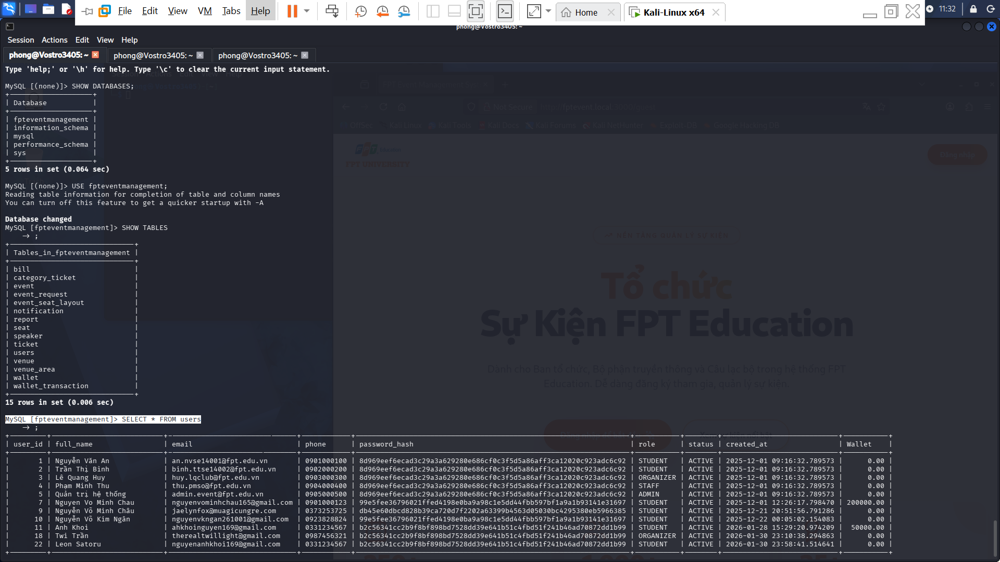
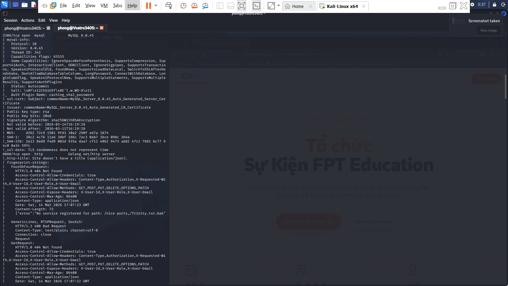
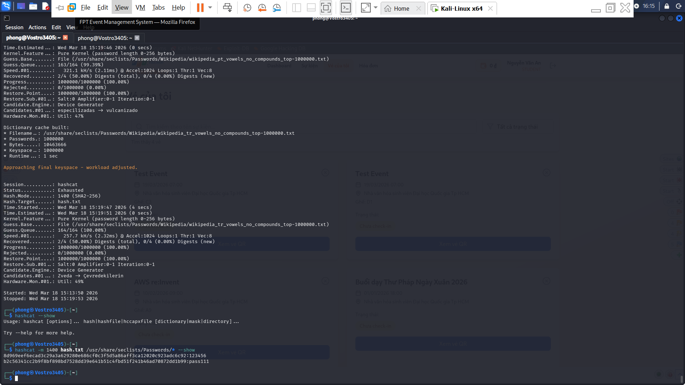
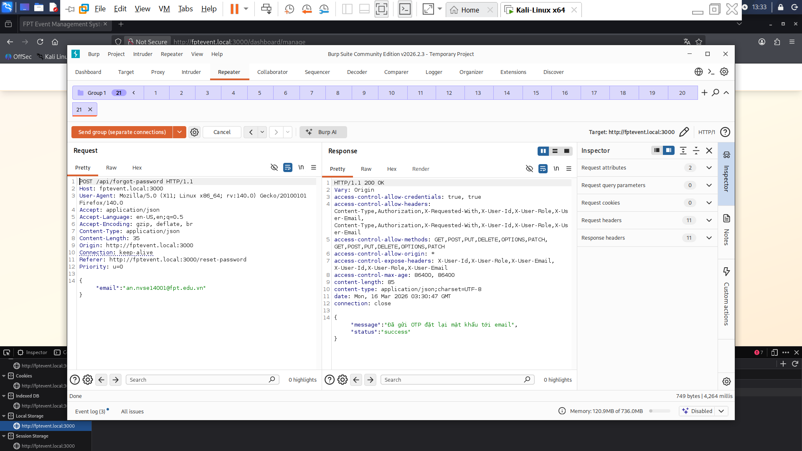
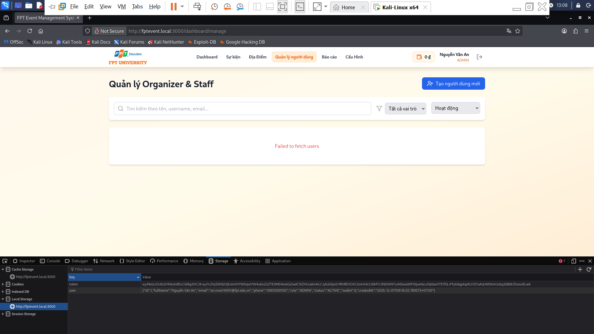

# BÁO CÁO KIỂM THỬ BẢO MẬT - PHASE 1 

**Dự án:** FPT Event Management System

**Ngày thực hiện:** 20/03/2026

**Người thực hiện:** Phong (Pentester)

**Mục tiêu:** fptevent.local

---

## 1. TÓM TẮT SƠ BỘ BÁO CÁO

Dự án FPT Event Management System hiện tại **CHƯA ĐỦ ĐIỀU KIỆN AN TOÀN** để triển khai lên hạ tầng thực tế (AWS) phục vụ cho đợt đánh giá đồ án. Quá trình kiểm thử đã phát hiện tổng cộng **08 lỗ hổng bảo mật**, trong đó có **02 lỗ hổng mức độ Nghiêm trọng (Critical)** và **03 lỗ hổng mức độ Cao (High)**. 

Đặc biệt, do hệ thống đang trong giai đoạn chuyển giao từ kiến trúc Local/Docker sang Cloud-Native (AWS), việc đội ngũ Phát triển đã áp dụng một số biện pháp khắc phục thủ công ở tầng Code (như tự cấu hình CORS, tự giới hạn Rate Limit) đang tạo ra nguy cơ **xung đột cấu hình** với các dịch vụ của AWS.

Để Go-Live thành công, nhóm không chỉ cần vá lỗi mà còn phải thực hiện chiến dịch "dọn dẹp": Loại bỏ các cơ chế bảo mật vòng ngoài trong mã nguồn Microservices để nhường quyền kiểm soát cho các dịch vụ chuyên dụng của AWS (SSM Parameter Store, WAF, ALB, API Gateway). Quá trình này được quy định chi tiết tại Mục 5.

## 2. PHẠM VI & PHƯƠNG PHÁP

* **Giai đoạn kiểm thử:** Hệ thống đang trong giai đoạn phát triển và tích hợp cục bộ (Local Development), chưa được DevOps triển khai lên hạ tầng thực tế (AWS Cloud). Đợt kiểm thử này mang tính chất **Shift-Left Security** nhằm triệt tiêu rủi ro từ sớm.
* **Hạ tầng hiện tại:** Kiến trúc Microservice được triển khai toàn bộ trên nền tảng Docker nội bộ.
* **Kịch bản giả định:** Kẻ tấn công được giả định là một cá nhân đã có quyền truy cập vào mạng nội bộ (LAN/Wi-Fi công ty) hoặc đã chiếm quyền điều khiển một thiết bị trong mạng (mô hình Assume Breach).
* **Phạm vi:** Các API và Web UI chạy trên Host `fptevent.local`, các port: `3000, 3306, 8080, 8081, 8082, 8083, 8084, 8085, 8086`.
* **Giới hạn kiểm thử:**
  * Chưa đánh giá rủi ro an toàn mạng nội bộ giữa các container (Container-to-Container lateral movement) trong trường hợp một node bị xâm nhập.
  * Chưa thể đánh giá bảo mật toàn diện `File Uploading Vulnerabilities` do môi trường Local thiếu cấu hình biến môi trường kết nối đến AWS S3.
* **Phương pháp:** Black-box/Grey-box testing từ xa qua mạng LAN, kết hợp White-box review cấu hình Docker.
* **Công cụ sử dụng:** Nmap, Burp Suite, OWASP ZAP, Trình duyệt web.

---

## 3. CHI TIẾT LỖ HỔNG KỸ THUẬT

**BẢNG TỔNG HỢP VÀ ĐÁNH GIÁ MỨC ĐỘ NGHIÊM TRỌNG (CVSS v3.1)**

| ID | Vulnerability | OWASP Top 10 | Severity | CVSS Score | State |
| :--- | :--- | :--- | :---: | :---: | :---: |
| **INF-01** | Direct Database Compromise via Weak/Default Root Credentials | A07: Authentication Failures | **Critical** | **9.8** | Open |
| **BE-01** | Internal Authentication Bypass & Data Exposure | A01: Broken Access Control | **Critical** | **9.1** | Open |
| **INF-02** | Architecture Misconfiguration (Exposed Ports) | A02: Security Misconfiguration | **High** | **8.6** | Open |
| **INF-03** | Sensitive Information Exposure via Development Server | A02: Security Misconfiguration | **High** | **7.5** | Open |
| **BE-02** | Cryptographic Failures via Weak Password Hashing | A04: Cryptographic Failures | **High** | **7.5** | Open |
| **FE-01** | Insecure Storage & UI State Manipulation | A07: Authentication Failures | **Medium** | **6.5** | Open |
| **BE-03** | Missing Anti-Automation and Rate Limiting on Password Reset | A06: Insecure Design | **Medium** | **5.3** | Open |
| **BE-04** | Insecure CORS Policy & Duplicate Headers | A02: Security Misconfiguration | **Medium** | **5.3** | Open |

### 3.1. Nhóm INF (Infrastructure - Hạ tầng & Cấu hình mạng)

#### INF-01. Direct Database Compromise via Weak/Default Root Credentials

* **Mức độ:** Nghiêm trọng.
* **Mô tả:** Cơ sở dữ liệu MySQL (3306) không chỉ bị bộc lộ ra ngoài mà còn cho phép kết nối từ xa (Remote Access) vào tài khoản `root` với mật khẩu yếu. Kết hợp với việc cấu hình SSL lỏng lẻo, kẻ tấn công có thể dễ dàng chiếm toàn quyền kiểm soát hệ thống cơ sở dữ liệu.
* **Proof of Concept (PoC):**
    1. Kẻ tấn công sử dụng công cụ dòng lệnh MySQL kết nối thẳng từ máy Kali Linux vào máy chủ bằng tài khoản `root` và cờ `--skip-ssl`:
    `mysql -h fptevent.local -u root -p --skip-ssl`
    2. Đăng nhập thành công và thực thi truy cập trích xuất dữ liệu từ bảng `users` trong cơ sở dữ liệu `fpteventmanagement`:

    ```sql
    MySQL [(none)]> USE fpteventmanagement;
    MySQL [fpteventmanagement]> SELECT * FROM users;
    ```

    3. Kết quả trả về chứa toàn bộ thông tin người dùng:

    

* **Tác động:** Kẻ tấn công có toàn quyền kiểm soát dữ liệu 100%. Chúng có thể đọc, sửa, xóa toàn bộ thông tin dự án, thao túng số dư ví điện tử, trộm thông tin cá nhân và mang các chuỗi `password_hash` về máy tính cá nhân để tiến hành bẻ khóa ngoại tuyến (Offline Cracking).
* **Khuyến nghị khắc phục:**
  * Sử dụng **Amazon RDS** cho Database thay vì host trên EC2/docker.
  * Đặt RDS vào **Private Subnet**, cấu hình Security Group chỉ cho phép Inbound traffic ở port 3306 đến từ Security Group của các dịch vụ Backend (Amazon ECS/EKS hoặc EC2). Tuyệt đối không bật tính năng `Publicly Accessible`.
  * Trong giai đoạn chuyển đổi đầu tiên, đảm bảo mật khẩu Database không bị đẩy lên mã nguồn công khai (GitHub/GitLab). Việc thiết lập kiến trúc quản lý Secret chuyên sâu bằng dịch vụ **AWS Systems Manager (SSM) Parameter Store** sẽ được đề xuất và rà soát chi tiết trong Báo cáo Pentest Giai đoạn 2.

#### INF-02. Architecture Misconfiguration

* **Mức độ:** Cao.
* **Mô tả:** File docker-compose.yml do Dev cung cấp cho môi trường Local đang bộc lộ tất cả các port của Microservice (8081-8086) và Database (3306) ra ngoài 0.0.0.0 thay vì chỉ dùng mạng nội bộ Docker.
* **Proof of Concept (PoC):**
    1. Đứng từ máy tấn công (Kali Linux), thực hiện quét Nmap tới Host của máy chủ: `nmap -sV -sC -sS -v fptevent.local`.
    2. Kết quả trả về cho thấy cổng 3306 (MySQL 8.0.45) và các cổng 8081-8086 (Golang net/http) mở trạng thái `open` và phản hồi lại các request HTTP chưa xác thực.

    

    3. Mặc dù các API nội bộ không có tài liệu công khai, kẻ tấn công có thể dò tìm và gửi request HTTP trực tiếp vào cổng 8083 (Ticket Service), bỏ qua hoàn toàn API Gateway (8080).
    4. Thực thi lấy dữ liệu trái phép mà không cần bất kỳ token xác thực nào:
    `curl -i http://fptevent.local:8083/api/registrations/my-tickets -H "X-User-Id: 1" -H "X-User-Role: Admin"`
    5. API nội bộ trả về mã `200 OK` kèm theo toàn bộ dữ liệu vé của khách hàng dưới dạng JSON:

    ```JSON
      [
      {
          "ticketId": 179,
          "ticketCode": "TKT_1032_220_77",
          "eventName": "AWS re:Invent",
          "venueName": "Nhà văn hóa sinh viên Đại học Quốc gia Tp HCM",
          "startTime": "2026-02-10T09:00:00+07:00",
          "status": "BOOKED",
          "checkInTime": null,
          "checkOutTime": null,
          "category": "VIP",
          "categoryPrice": 250000,
          "seatCode": null,
          "buyerName": "Nguyễn Văn An",
          "purchaseDate": "2026-02-10T09:00:00+07:00"
      },
      {
          "ticketId": 39,
          "ticketCode": "iVBORw0KGgoAAA...[truncated_base64_string]...",                                            "eventName": "Buổi dạy Thư Pháp Ngày Xuân 2026",
          "venueName": "Nhà văn hóa sinh viên Đại học Quốc gia Tp HCM",
          "startTime": "2026-01-01T18:00:00+07:00",
          "status": "BOOKED",
          "checkInTime": null,
          "checkOutTime": null,
          "category": "STANDARD",
          "categoryPrice": 10000,
          "seatCode": null,
          "buyerName": "Nguyễn Văn An",
          "purchaseDate": "2026-01-01T18:00:00+07:00"
      }
      ]
    ```

* **Tác động:** Nếu hệ thống này được deploy trực tiếp lên AWS mà không tinh chỉnh lại, toàn bộ hạ tầng sẽ bị phơi bày ra Internet. Nguy hiểm hơn, kẻ tấn công có thể trực tiếp gửi request giả mạo đặc quyền (X-User-Role: Admin) vào các cổng nội bộ (như 8083) để đánh cắp dữ liệu kinh doanh cốt lõi (thông tin vé, khách hàng, doanh thu) mà không bị API Gateway ngăn chặn.
* **Khuyến nghị khắc phục:**
  * **Dev:** Sửa lại file docker-compose.yml nội bộ: gỡ bỏ ports: ở các service Backend và database.
  * **DevOps:**
    * Khi phác thảo kiến trúc AWS (VPC, Subnet), phải thiết kế Security Group chặt chẽ, chỉ mở port 80/443 ở lớp Load Balancer/API Gateway.
    * Toàn bộ các Backend Microservices triển khai qua ECS phải được đặt trong **Private Subnets**.
    * Chặn toàn bộ Inbound traffic trực tiếp từ Internet vào các node Backend, bắt buộc cấu hình Security Group của **ALB** chỉ cho phép nhận lưu lượng truy cập đến từ dải IP của **Amazon API Gateway**.

#### INF-03. Sensitive Information Exposure via Development Server

* **Mức độ:** Cao.
* **Mô tả:** Qua quá trình rà quét hệ thống bằng công cụ OWASP ZAP, phát hiện máy chủ Frontend đang được vận hành bằng Development Vite thay vì bản Build Production. Việc cấu hình như này trong giai đoạn đóng gói Docker Local khiến máy chủ không nén (`minify`) hay làm rối (`obfuscate`) mã nguồn mà trực tiếp phơi bày toàn bộ cấu trúc thư mục gốc, mã nguồn và danh sách thư viện gốc của dự án ra bên ngoài.
* **Proof of Concept (PoC):**
  1. Đứng từ máy tấn công (Kali Linux), sử dụng OWASP ZAP thực hiện thu thập các endpoint của mục tiêu `http://fptevent.local:3000`.
  2. Kết quả trả về hàng loạt các đường dẫn chứa mã nguồn gốc chưa qua biên dịch, bao gồm:
  * `http://fptevent.local:3000/src/App.tsx`
  * `http://fptevent.local:3000/src/pages/AdminDashboard.tsx`
  * `http://fptevent.local:3000/src/utils/imageUpload.ts`
  * Hàng loạt thư viện phụ thuộc tại `http://fptevent.local:3000/node_modules/.vite/deps/...`
  3. Kẻ tấn công có thể truy cập trực tiếp các file này trên trình duyệt và có thể phân tích logic hệ thống dễ dàng.
* **Tác động:**
  * **Source Code Disclosure:** Cung cấp cho kẻ tấn công bản đồ kiến trúc Frontend hoàn chỉnh. Nhờ đó, chúng có thể dễ dàng phân tích các thuật toán kiểm tra tính hợp lệ nhằm chế tạo các payload qua mặt hệ thống phòng thủ.
  * **Supply Chain Exposure:** Việc lộ lọt các thư viện phụ thuộc sẽ giúp kẻ tấn công xác định được chính xác phiên bản của từng thư viện được sử dụng, từ đó đối chiếu với các CVEs để tìm các lỗ hổng đã biết và tấn công khai thác.
* **Khuyến nghị khắc phục:**
  * **Dev:** Chỉnh sửa lại `Dockerfile` của Frontend, tuyệt đối không sử dụng `npm run dev` để chạy container. Thay vào đó, sử dụng `npm run build`.
  * **DevOps:**
    * Khi thiết kế hạ tầng AWS, đảm bảo Frontend phải được host trên `AWS S3 kết hợp CloudFront`, chặn đứng hoàn toàn rủi ro trên môi trường Development khi đưa lên Production.
    * Cấu hình **Origin Access Control (OAC)** hoặc **Origin Access Identity (OAI)** cho CloudFront. Thiết lập Bucket Policy của S3 chặn toàn bộ quyền `Public Read` trực tiếp, bắt buộc người dùng chỉ có thể tải Frontend thông qua CDN của CloudFront.

### 3.2. Nhóm BE (Backend - API & Database Logic)

#### BE-01. Internal Authentication Bypass & Data Exposure

* **Mức độ:** Nghiêm trọng.
* **Mô tả:** Hệ thống áp dụng cơ chế bảo mật thiếu an toàn (Security by Obscurity) cho các luồng giao tiếp nội bộ giữa các Microservice. Qua rà soát mã nguồn và kiểm thử thực tế tại cổng 8081 (Auth/User Service), API nội bộ `/internal/user/profiles` chỉ dựa vào một HTTP Header tĩnh là `x-internal-call: true` để cấp quyền truy cập mà không có cơ chế xác minh danh tính mã hóa nào.
* **Proof of Concept (PoC):**
    1. Kẻ tấn công gửi một request HTTP GET trực tiếp vào cổng 8081, nhắm vào API nội bộ và giả mạo Headers được yêu cầu:
    `curl -i "http://fptevent.local:8081/internal/user/profiles?userIds=1" -H "x-internal-call: true"`
    2. Hệ thống bị đánh lừa và trả về mã `200 OK` kèm theo toàn bộ dữ liệu định danh PII của người dùng tương ứng:

    ```JSON
    [
      {
        "userId": 1,
        "fullName": "Nguyễn Văn An",
        "email": "an.nvse14001@fpt.edu.vn",
        "phone": "0901000100",
        "role": "STUDENT"
      }
    ]
    ```

* **Tác động:** Kẻ tấn công dễ dàng trích xuất toàn bộ cơ sở dữ liệu người dùng của dự án. Việc này gây rò rỉ thông tin về email, số điện thoại của người dùng, vi phạm nghiêm trọng các nguyên tắc bảo mật thông tin.
* **Khuyến nghị khắc phục:**
  * **Dev:** Loại bỏ việc kiểm tra quyền bằng Header tĩnh `x-internal-call`. Thiết lập cơ chế xác thực Service-to-Service an toàn. Phương án khả thi nhất hiện tại là sử dụng một **INTERNAL_SECRET_KEY** dùng chung (lưu trong file `.env`) để tạo hàm băm (**HMAC**) xác thực request, hoặc cấp phát một **Internal JWT** dành riêng cho các Microservice giao tiếp với nhau.
  * **DevOps:** Áp dụng **AWS Security Group** để quy định rõ service nào được phép gọi service nào trong **Private Subnet**.

#### BE-02. Cryptographic Failures via Weak Password Hashing

  * **Mức độ:** Cao.
  * **Mô tả:** Qua quá trình trích xuất dữ liệu người dùng từ Database, phát hiện hệ thống Backend đang lưu trữ mật khẩu người dùng bằng các thuật toán băm yếu và không sử dụng Salt. Việc thiếu cơ chế Salt ngẫu nhiên khiến các chuỗi Hash trở thành dạng tĩnh (cùng mật khẩu sẽ cho ra cùng chuỗi Hash giống hệt nhau). Điều này khiến hệ thống cực kỳ dễ bị tổn thương trước các cuộc tấn công Offline Cracking bằng từ điển hoặc Rainbow Tables.
  * **Proof of Concept (PoC):**
    1. Kẻ tấn công trích xuất danh sách `password_hash` từ bảng `users` thông qua lỗ hổng lộ lọt Database.
    ```bash
    mysql -h fptevent.local -u root -p --skip-ssl -s -N -e "select password_hash from users;" fpteventmanagement | sort -u > hash.txt
    ```
    2. Sử dụng công cụ `hashcat` kết hợp với bộ từ điển mật khẩu phổ biến trên thế giới `rockyou.txt`.
    ```bash
    hashcat -m 1400 hash.txt /usr/share/wordlists/rockyou.txt
    ```
    3. **Kết quả:** Do thiếu Salt, các mật khẩu người dùng (nếu nằm trong từ điển hoặc dễ đoán) sẽ bị công cụ bẻ khóa đối chiếu và dịch ngược ra dạng rõ.
    
  * **Tác động:**
    * **Account Takeover:** Kẻ tấn công có thể thu thập được mật khẩu gốc và chiếm đoạt hoàn toàn tài khoản người dùng.
    * **Credential Stuffing:** Do thói quen sử dụng chung mật khẩu cho nhiều dịch vụ, việc lộ mật khẩu rõ tại hệ thống này sẽ trở thành rủi ro gây lộ mật khẩu liên đới cho người dùng ở các nền tảng mạng xã hội, ngân hàng hoặc email cá nhân.
  * **Khuyến nghị khắc phục:**
    * Loại bỏ các thuật toán băm cũ SHA-256 thuần, chuyển sang sử dụng các thuật toán băm mật khẩu chuyên dụng có tích hợp sẵn cơ chế sinh Salt ngẫu nhiên và tốn chi phí tính toán (BCrypt, Argon2, hoặc Scrypt).
    * Trong nền tảng Golang, khuyến nghị sử dụng các thư viện chuẩn `golang.org/x/crypto/bcrypt` để xử lý hàm băm mật khẩu khi đăng ký và kiểm tra đăng nhập. Mức độ chi phí (Work Factor) nên được cấu hình từ 10 đến 12 cân bằng giữa bảo mật và hiệu năng máy chủ.

#### BE-03. Missing Anti-Automation and Rate Limiting on Password Reset API

* **Mức độ:** Cao.
* **Mô tả:** Qua quá trình phân tích mã nguồn Frontend và kiểm thử động, phát hiện tính năng "Quên mật khẩu" hoàn toàn không có cơ chế chống tự động hóa và giới hạn tần suất. Mã nguồn `src/pages/ResetPassword.tsx` không tích hợp Google reCAPTCHA. Phía Backend cũng không áp dụng giới hạn số lượng request gọi đến API gửi email OTP.
* **Proof of Concept (PoC):**
    1. Truy cập chức năng Quên mật khẩu trên giao diện Frontend.
    2. Nhập 1 địa chỉ email bất kỳ và nhấn "Gửi mã OTP"
    3. Sử dụng BurpSuite để Intercept request `POST /api/forgot-password`.
    4. Đưa request này qua `Repeater` và thực hiện gửi hàng loạt 20 requests liên tục.
    5. Kết qua: toàn bộ 20 requests đều trả về `200 OK`, không có bất kỳ request nào bị chặn lại bởi lỗi `429 Too Many Requests` hay các cơ chế chống Spam khác.

    

* **Tác động:**
  * **Email Spamming:** Kẻ tấn công có thể sử dụng công cụ tự động để gửi hàng ngàn requests OTP đến một hộp thư mục tiêu, gây gián đoạn công việc của nạn nhân.
  * **Resource Exhaustion:** Nếu hệ thống sử dụng dịch vụ Email thực tế (như AWS SES, SendGrid) trên Production, việc lạm dụng API này sẽ dẫn đến máy chủ Backend liên tục gọi đến dịch vụ email (SMTP/SES) gây rủi ro phát sinh chi phí không đáng có và tên miền bị đưa vào danh sách đen do hành vi gửi thư rác.
* **Khuyến nghị khắc phục:**
  * **Tầng AWS WAF (Chống Spam mục tiêu):** Cấu hình Rate-Based Rules trên WAF để giám sát theo địa chỉ IP. Nếu một IP gửi vượt quá số lượng request cho phép (ví dụ: 5 requests/phút) vào đích danh endpoint `/api/forgot-password`, WAF sẽ tự động chặn đứng (Block) IP đó, triệt tiêu hoàn toàn kịch bản Spam Email.
  * **Tầng API Gateway:** Bật tính năng Throttling (Usage Plans) trên **Amazon API Gateway** để giới hạn tỷ lệ gọi API.

#### BE-04. Insecure CORS Policy & Duplicate Headers

  * **Mức độ:** Trung bình.
  * **Mô tả:** Hệ thống API Backend đang thiết lập chính sách CORS (Cross-Origin Resource Sharing) sai nguyên tắc bảo mật. Gói tin phản hồi chứa cấu hình `access-control-allow-origin: *` đi kèm với `access-control-allow-credentials: true`. Theo chuẩn bảo mật W3C, khi cho phép gửi thông tin xác thực, `Origin` bắt buộc phải được định danh cụ thể thay vì dùng ký tự `Wildcard`. Ngoài ra, các header CORS đang bị nhân đôi (Duplicate) do sự chồng chéo cấu hình giữa lớp API Gateway và Backend Microservice.
  * **Proof of Concept (PoC):**
    1. Kẻ tấn công gửi một request HTTP GET đến endpoint `/api/wallet/balance` với header `Origin: http://evil.hacker.local`.
    2. Backend phản hồi trả về `200 OK`, cụm Header lỗi hiển thị rõ việc lặp lại và cấu hình sai:
    ```http
    HTTP/1.1 200 OK
    Vary: Origin
    access-control-allow-credentials: true, true
    access-control-allow-headers: Content-Type,Authorization,X-Requested-With,X-User-Id,X-User-Role,X-User-Email, Content-Type,Authorization,X-Requested-With,X-User-Id,X-User-Role,X-User-Email
    access-control-allow-methods: GET,POST,PUT,DELETE,OPTIONS,PATCH, GET,POST,PUT,DELETE,OPTIONS,PATCH
    access-control-allow-origin: *
    access-control-expose-headers: X-User-Id,X-User-Role,X-User-Email, X-User-Id,X-User-Role,X-User-Email
    access-control-max-age: 86400, 86400
    content-length: 16
    content-type: application/json;charset=UTF-8
    date: Thu, 19 Mar 2026 08:05:05 GMT
    connection: close

    {"balance":0.00}
    ```
  * **Tác động:** Việc kết hợp Wildcard `*` và `Credentials: true` tạo ra rủi ro rò rỉ dữ liệu. Mặc dù các trình duyệt web hiện đại (Chrome, Firefox) sẽ chủ động chặn truy cập để bảo vệ người dùng. Tuy nhiên, do hệ thống sử dụng cơ chế xác thực Stateless thay vì Cookie, rủi ro đánh cắp dữ liệu chéo tên miền đã được giảm thiểu tự nhiên. Tác động cốt lõi của lỗ hổng này nằm ở việc lặp lại Header gây lãng phí băng thông và có nguy cơ dẫn đến các lỗi phân tích cú pháp tại các bộ định tuyến mạng trung gian.
  * **Khuyến nghị khắc phục:**
    * Rà soát lại luồng đi của gói tin từ API Gateway xuống các Service Golang bên trong. Chỉ thực hiện gắn Header CORS ở một lớp duy nhất tại lớp API Gateway.
    * Loại bỏ ký tự `*` tại `Access-Control-Allow-Origin`. Cần chỉ định rõ danh sách các tên miền hợp lệ được phép gọi API.
    * Gỡ bỏ toàn bộ code xử lý CORS (middleware) bên trong các container Golang để tránh tình trạng Duplicate Headers với API Gateway/ALB.

### 3.3. Nhóm FE (Frontend - React & Client-side)

  #### FE-01. Insecure Storage & UI State Manipulation

  * **Mức độ:** Trung bình.
  * **Mô tả:** Hệ thống Frontend gặp phải 2 lỗi thiết kế nghiêm trọng trong việc quản lý phiên đăng nhập:
    * **Lưu trữ không an toàn:** Token JWT được lưu trữ tại `localStorage`. Trình duyệt cho phép bất kỳ mã JavaScript nào cũng có thể truy xuất vùng nhớ này, khiến hệ thống cực kỳ nhạy cảm với các cuộc tấn công Cross-Site Scripting (XSS).
    * **Client-Side Access Control Bypass:** Frontend sử dụng đối tượng `user` lưu dưới dạng JSON plain-text trong `localStorage` để quyết định hiển thị Menu và Route dành riêng cho Admin/Staff.
  * **Proof of Concept (PoC):**
    1. Đăng nhập vào hệ thống bằng tài khoản sinh viên (email: <an.nvse14001@fpt.edu.vn>; role: STUDENT).
    2. F12 mở Developer Tools -> Application/Storage -> Local Storage.
    3. Quan sát thấy JWT Token được lưu tại key `token`, thông tin người dùng lưu tại `user`.
    4. Thực hiện chỉnh sửa giá trị của key `user`, thay đổi `"role":"STUDENT"` thành `"role":"ADMIN"`.
    5. Tải lại trang (F5), hệ thống Frontend bị đánh lừa và hiển thị toàn bộ giao diện, chức năng dành riêng cho Quản trị viên hệ thống.

    

    6. Tuy nhiên, khi thực hiện tạo người dùng mới, hành vi đã bị Backend chặn lại chính xác với mã `403 Forbidden` dựa trên JWT Token.
  * **Tác động:** Hệ thống hiện tại đang phòng chống XSS rất hiệu quả nhờ cơ chế escape mặc định của React. Tuy nhiên, việc đặt JWT nguyên bản dưới dạng plain-text tại `localStorage` tạo ra một điểm yếu cố hữu. Nếu trong tương lai, quá trình phát triển vô tình tích hợp một thư viện bên thứ 3 dính mã độc, toàn bộ Token của người dùng sẽ lập tức bị bòn rút mà không có lớp bảo vệ thứ hai.
  * **Khuyến nghị khắc phục:**
    * Lưu trữ JWT bằng `Cookies` với các flag `HttpOnly`, `Secure`, `SameSite=Strict` để ngăn chặn JavaScript truy cập.
    * Không lưu trữ trực tiếp `user` dưới dạng plain-text ở LocalStorage. Đề xuất cho Frontend gọi một API định danh (`api/auth/me`) mỗi khi load trang nhạy cảm để xác minh quyền hạn từ Backend trước khi render giao diện.
    * Lưu ý cấu hình Route53 (nếu có) và ALB để Frontend và Backend API nằm trên cùng Root Domain.

---

## 4. ĐIỂM SÁNG BẢO MẬT & THÔNG TIN BỔ SUNG

Môi trường hiện tại là Local Docker, do đó một số cấu hình mạng và mã hóa mang tính chất mặc định của nền tảng. Tuy nhiên, để chuẩn bị cho giai đoạn đưa hệ thống lên hạ tầng AWS Production, cần lưu ý các điểm sau:

* **Mã hóa đường truyền (In-Transit Encryption):** Các cổng giao tiếp của Frontend (3000) và API Gateway (8080) hiện đang chạy HTTP thuần (Plain-text). Khi lên AWS, **bắt buộc** phải cấu hình TLS/SSL (HTTPS) tại lớp Load Balancer (ALB) hoặc API Gateway để mã hóa toàn bộ lưu lượng giao tiếp với người dùng cuối, chống lại các cuộc tấn công nghe lén (Sniffing/MiTM).
* **Quản lý biến môi trường (Secrets Management):** Tuyệt đối không tái sử dụng các mật khẩu cơ sở dữ liệu hoặc `INTERNAL_SECRET_KEY` từ môi trường Local đưa lên Production. Cần sử dụng các dịch vụ chuyên dụng như **AWS Systems Manager (SSM) Parameter Store** để quản lý key thay vì hardcode trong file `.env`.
* **Kiểm soát phân quyền cấp API (Strict Authorization):** Mặc dù Frontend bị vượt qua do lỗi lưu trữ LocalStorage, Backend API vẫn thực hiện xác thực quyền (Role-based Access Control) cực kỳ chặt chẽ, các nỗ lực nhằm leo thang đặc quyền đều bị chặn đứng với mã lỗi `403 Forbidden`.
* **Tích hợp thanh toán an toàn (Secure Payment Gateway):** Luồng tạo giao dịch thanh toán được thiết kế bảo mật. Chữ ký số được tính toán tại Backend, ngăn chặn thành công tấn công thao túng tham số khi kẻ tấn công cố tình đổi giá vé trên đường truyền.
* **Phòng chống tương tranh dữ liệu (Race Condition Prevention):** Luồng kế toán hoàn tiền và ví điện tử được thiết kế cơ chế Database Lock/Transaction xuất sắc. Các đợt tấn công ép xung đa luồng nhằm nhân bản số dư ví điện tử đều bị chặn hoàn toàn.
* **Kiểm soát toàn vẹn tham số (Parameter Integrity):** Backend tự động tính toán giá trị tiền từ Transaction của CSDL, không phụ thuộc vào dữ liệu do Frontend gửi lên.
* **Phân quyền cấp độ Object (IDOR/BOLA Protection):** Chức năng Check-in tại cổng sự kiện áp dụng xác thực chéo (Cross-ownership) nghiêm ngặt. Chỉ Organizer chính chủ mới được phép thao tác quét vé trên sự kiện của mình.
* **Kiểm soát thời gian Check-in (Time-based State Machine):** Ngăn triệt để hành vi Check-in trước thời gian quy định (`checkinAllowedBeforeStartMinutes`).
* **Cô lập hệ thống tập tin (File System Isolation):** Mặc dù Database bị xâm nhập, biến `secure_file_priv` của MySQL được cấu hình chuẩn mực `/var/lib/mysql-files/`, chặn đứng hoàn toàn chiến thuật leo thang đặc quyền từ Database lên hệ điều hành (RCE thông qua INTO OUTFILE).

---

## 5. KẾ HOẠCH CHUYỂN ĐỔI & XỬ LÝ XUNG ĐỘT

Do hệ thống đang cấu hình theo chuẩn Local Docker và tự xử lý bảo mật bằng code, việc đưa thẳng lên AWS sẽ gây xung đột với các Managed Services. DevOps/Dev cần thực hiện chuẩn hóa theo 3 giai đoạn (Phase):

### Phase 1: Dọn dẹp mã nguồn & Cấu hình Local

  * **Backend:** Gỡ bỏ hoàn toàn các đoạn code/middleware tự xử lý CORS và Rate Limiting bằng Golang. Xóa bỏ các thông tin nhạy cảm (Secret Key, DB Password) đang bị hardcode trong file `.env`. 
  * **Frontend:** Điều chỉnh `Dockerfile` sang chế độ Production (`npm run build`).
  * **Hạ tầng Local:** Hủy bỏ (Deprecate) container MySQL trong file `docker-compose.yml`, tiến hành dump dữ liệu (`mysqldump`) chuẩn bị chuyển lên RDS.

### Phase 2: Khởi tạo Hạ tầng AWS

  * **Database & Secrets:** Khởi tạo Amazon RDS. Sử dụng các công cụ quản trị Database (MySQL Workbench) kết nối thẳng vào Endpoint của RDS và chạy trực tiếp script SQL để tái tạo cấu trúc bảng và nạp dữ liệu. Thiết lập AWS SSM Parameter Store để lưu trữ chuỗi kết nối an toàn.
  * **Network & Security:** Đưa toàn bộ ECS Backend vào Private Subnet. Thiết lập Security Group chỉ cho phép giao tiếp nội bộ. Triển khai thêm NAT Gateway tại Public Subnet để cấp quyền truy cập Internet một chiều (Outbound-only), giúp các Microservice giao tiếp an toàn với các dịch vụ nằm ngoài VPC (SQS, SES, S3).
  * **Vòng ngoài:** Khởi tạo S3 + CloudFront cho Frontend. Cấu hình Amazon API Gateway (bật Throttling, xử lý CORS) và AWS WAF (chặn IP Spam OTP) để làm lá chắn thép cho Backend.

### Phase 3: Tích hợp & Nghiệm thu

  * **Hợp nhất Domain:** Cấu hình **AWS CloudFront Behaviors** để định tuyến luồng truy cập Frontend (từ S3) và Backend API (từ API Gateway/ALB) cùng hoạt động trên một Root Domain duy nhất, qua đó kích hoạt thành công cơ chế `HttpOnly Cookies` lưu trữ JWT.
  * **Nghiệm thu:** Sau khi hoàn thiện tích hợp, đội ngũ Security sẽ tiến hành rà quét lại (Re-test) toàn bộ luồng dữ liệu trên AWS Staging để cấp quyền Go-Live chính thức.
