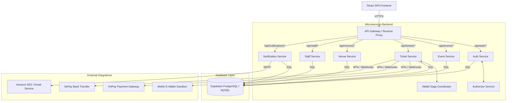

# FPT Event Management System (FEMS)

FEMS is an enterprise-grade, high-integrity event ticketing and management platform designed specifically for the FPT University campus ecosystem. The platform enables automated event proposal workflows, secure ticket purchase operations via multiple payment gateways, on-site QR-code verification, and robust operational dashboards.

---

## 🏗️ System Architecture

The platform is designed around a distributed, containerized microservices architecture to enforce clean domain boundaries, ensure high availability, and support independent scalability.



### Technical Stack Breakdown

#### Frontend Workspace
- **Core Library**: React (v18.2) & TypeScript.
- **Styling**: Tailwind CSS & Vanilla CSS configurations.
- **UI Components & Icons**: Lucide React, Recharts (for analytics visualizations).
- **Security & APIs**: Axios with custom interceptors for session invalidation, integration with Google reCAPTCHA v2 and Google OAuth.
- **Routing**: React Router DOM (v6).

#### Backend Microservices
- **Language**: Go 1.25.
- **Frameworks & Libs**: Gin Gonic (REST APIs), GORM (Object Relational Mapping), Go-JWT, Go-QRCode, gofpdf (PDF generation).
- **Communication & Gateway**: Reverse proxy API Gateway coordinating routing. Internal microservice-to-microservice traffic is authenticated via an internal token header (`X-Internal-Token`) with context propagation and exponential backoff retry.
- **Transactional Consistency**: Saga Pattern Orchestrator for wallet transaction handling to ensure atomicity across ticket and billing domains.

#### Database Layer
- **Relational DBMS**: Supabase PostgreSQL (Production) / MySQL 8.0 (Local Dev).
- **Security Hardening**: Row-Level Security (RLS) policies enabled in Supabase to restrict table records access.
- **Optimizations**: Custom indexes on foreign keys (`user_id`, `event_id`, `seat_id`, `bill_id`) and constraints (`price` check constraint ensuring values lie between 0 and 100M VND).

---

## 👥 Core Business Features & Role-Based Permissions

The system exposes specific dashboards and features customized to FPT University user roles:

### 🎓 STUDENT
- **Event discovery**: Search, filter, and view detailed descriptions, schedules, and speakers of open events.
- **Interactive Ticket Booking**: Select tickets (Standard/VIP) using an interactive seat map with real-time seat reservation holds.
- **Instant Checkout**: Execute payments using VNPay, MoMo E-Wallet sandbox, or the integrated internal student E-Wallet.
- **Ticket Management**: Access personal ticket history, retrieve invoice receipts, and download tickets with dynamically rendered, Base64-encoded QR codes.
- **Venue Attendance**: Self-check-in and check-out at event venues via scan validations.

### 🏫 ORGANIZER
- **Event Proposals**: Submit venue allocation requests with requested capacity, preferred times, and speaker details.
- **Speaker Roster Management**: Edit bios, profile avatars, and contact information for event speakers.
- **Real-Time Analytics**: View event registration tallies, seat occupancy maps, and ticketing revenue breakdowns.
- **Attendance Verification**: Scan student QR codes to record check-in and check-out times.
- **Feedback & Reporting**: Review attendee reports and event surveys.

### 🛡️ STAFF
- **Event Audit & Approval**: Review pending event hosting requests, approve venue bookings, or reject proposals with structured feedback.
- **Customer Service Escalations**: Process student refund claims, review report reports, and issue tickets on-site.
- **Database Oversight**: Verify manual check-ins and process offline registrations.

### 🔑 ADMIN
- **System Settings**: Set global parameters (such as booking timeouts, holding limits, and system configurations).
- **Lifecycle Control**: Control global user states (Activate, Deactivate, Block accounts).
- **Financial Audit**: Review global wallet transactions, invoice logs, and platform revenue stats.
- **Infrastructure Auditing**: Monitor system resource limits, error logs, and data integrity states.

---

## 🔒 Security Hardening Status

Active production-grade defenses implemented across both frontend and backend codebases:

1. **SQL Injection Mitigation**: Pure prepared statements and parameter bindings are utilized throughout the Go ORM/SQL layers, blocking raw string concatenation in queries.
2. **Session Hijacking (XSS) Protections**: JWT session tokens are stored exclusively in in-memory React state and `HttpOnly`, `SameSite=Secure` browser cookies. No sensitive auth details exist in JavaScript-accessible storage.
3. **Multi-Tab Storage Invalidation**: A window storage event listener continuously monitors client-side storage, immediately purging any unauthorized attempts to set user or session keys in `localStorage` or `sessionStorage`.
4. **Strict Fail-Closed Webhooks**: Inbound payment webhooks (MoMo, SePay, VNPay) are verified via strict cryptographic HMAC-SHA256 signature checking. Discrepancies in signature, transaction amount, or payload immediately trigger a transaction rollback and abort.

---

## 🔄 Technical Migration History

### Wallet Refactoring (users table cleanup)
During architectural optimization, the legacy `Wallet` decimal column was dropped from the main `users` table. The application now fully relies on a normalized separate `wallet` table relationship model:
- Mapped as a strict 1-to-1 relationship between `users` and `wallet` tables.
- Linked via `user_id` foreign key with a `UNIQUE` constraint and Row-Level Security enabled.
- Ensures distinct accounting boundaries, isolated transactional locking (`SELECT ... FOR UPDATE`), and clean audit logging inside `wallet_transaction`.

---

## 🚀 Running Locally

### Option 1: Docker Compose (Recommended)
Required: Docker Desktop installed.

```bash
# Start all microservices, frontend, and DB containers
docker compose up --build

# Shutdown the container network
docker compose down
```

### Option 2: Bare Metal Local Execution

#### Backend Setup
Required: Go 1.25+ installed.

```bash
cd backend
# Run local development API adapter mode
go run ./cmd/local-api
```

#### Frontend Setup
Required: Node.js 20+ installed.

```bash
cd frontend
# Install package dependencies
npm install

# Start Vite hot-reload development server
npm run dev
```
