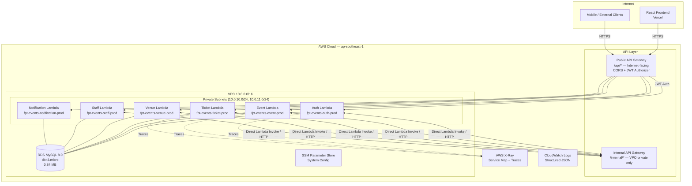
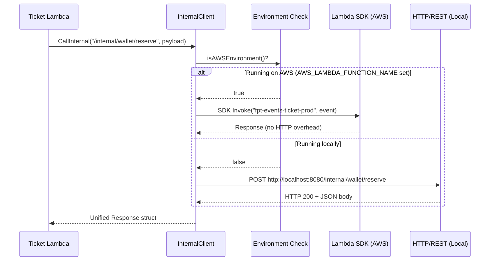
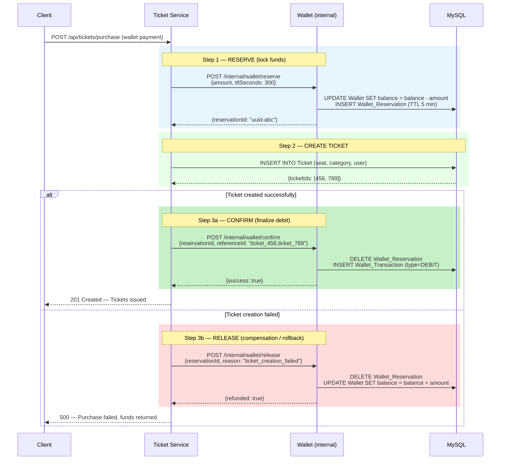
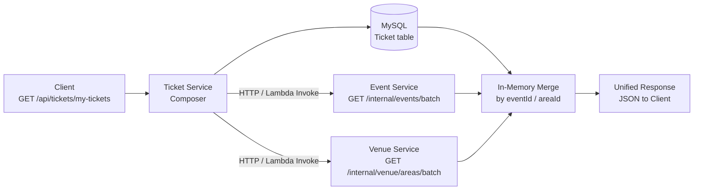
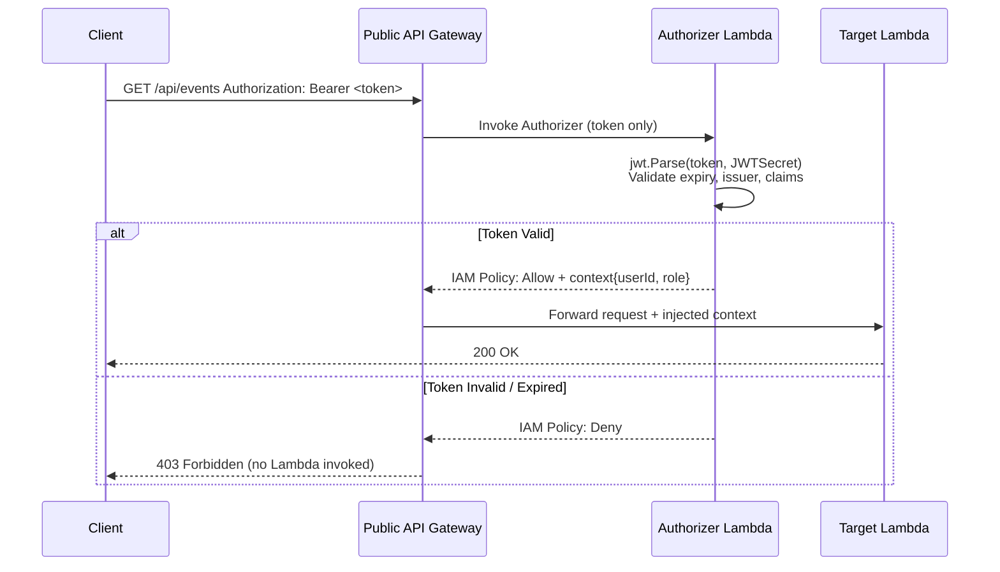

# FPT Event Management System — Technical Report

**Architecture:** Microservices on AWS Serverless  
**Version:** 1.0 · **Status:** 95% Complete · **Compile Errors:** 0  
**Repository:** [AK17-LeonSatoru/FPT_EVENT_MANAGEMENT_80percent-Microservices](https://github.com/AK17-LeonSatoru/FPT_EVENT_MANAGEMENT_80percent-Microservices.git)  
**Audience:** Solution Architect, Technical Lead, Cloud Engineer

---

## Table of Contents

1. [Executive Summary](#1-executive-summary)
2. [System Architecture](#2-system-architecture)
3. [Technology Stack](#3-technology-stack)
4. [Advanced Patterns Applied](#4-advanced-patterns-applied)
5. [Database Design & Optimization](#5-database-design--optimization)
6. [Operation Guide](#6-operation-guide)
7. [Observability & Security](#7-observability--security)
8. [Feature Flag Strategy](#8-feature-flag-strategy)
9. [API Reference](#9-api-reference)

---

## 1. Executive Summary

**FPT Event Management System** is a production-grade event management platform purpose-built for FPT University. The system has successfully completed a full architectural migration from a **Go Modular Monolith** to a **cloud-native Microservices** deployment on AWS Serverless infrastructure.

### Migration Goals Achieved

| Objective | Status |
|-----------|--------|
| Decompose Monolith into independent Lambda services | ✅ 6 Lambdas deployed |
| Eliminate cross-service SQL JOINs | ✅ API Composition Pattern |
| Distributed transaction safety for Wallet | ✅ Saga Pattern (Reserve → Confirm → Release) |
| Zero-downtime migration path | ✅ 10 Feature Flags — rollback in seconds |
| Database optimization | ✅ 0.84 MB — indexes rebuilt, zero fragmentation |
| Direct Lambda invocation (skip Internal API GW overhead) | ✅ AWS SDK v2 Lambda Invoke |
| End-to-end distributed tracing | ✅ AWS X-Ray + Correlation IDs |

### Key Metrics

| Metric | Value |
|--------|-------|
| Services | 6 Lambda Functions |
| Compile Errors | 0 |
| Database Size | 0.84 MB (optimized) |
| Wallet Refund Rate | 0.52% |
| Seat Allocation | 10×10 matrix, VIP-first |
| Lambda Architecture | arm64 (Graviton2) |
| Cold Start Runtime | `provided.al2023` (Go binary, ~15 ms) |
| Deployment Region | ap-southeast-1 (Singapore) |

---

## 2. System Architecture

### 2.1 High-Level Overview

The system is composed of **6 independent Lambda functions**, a dual-layer API Gateway (Public + Internal), an AWS VPC for network isolation, and a shared RDS MySQL instance for data persistence.



### 2.2 Service Catalogue

| # | Service | Lambda Function | Primary Responsibility |
|---|---------|----------------|------------------------|
| 1 | **Auth** | `fpt-events-auth-prod` | Registration, Login, OTP, JWT issuance, account management |
| 2 | **Event** | `fpt-events-event-prod` | Event CRUD, approval workflow, venue scheduling, auto-close scheduler |
| 3 | **Ticket** | `fpt-events-ticket-prod` | Ticket purchase, Wallet/VNPay payment, Saga coordinator, seat allocation |
| 4 | **Venue** | `fpt-events-venue-prod` | Venue area management, seat map (10×10), availability tracking |
| 5 | **Staff** | `fpt-events-staff-prod` | QR check-in/out, refund processing, reporting & analytics |
| 6 | **Notification** | `fpt-events-notification-prod` | Email delivery, PDF ticket generation, QR code rendering |

### 2.3 Shared Database Architecture Pattern

The system uses a **Shared Database** model with **logically separated business domains**. Each service owns its domain tables and communicates with other domains exclusively via APIs — never via cross-domain SQL JOINs.

```
┌───────────────────────────────────────────────────────────────┐
│                   RDS MySQL — fpt_event_management            │
│                                                               │
│  ┌─────────────┐  ┌─────────────┐  ┌─────────────────────┐    │
│  │ Auth Domain │  │ Event Domain│  │   Ticket Domain     │    │
│  │─────────────│  │─────────────│  │─────────────────────│    │
│  │ Users       │  │ Event       │  │ Ticket              │    │
│  │ OTP_Codes   │  │ Event_Request│ │ Category_Ticket     │    │
│  │ User_Role   │  │ Speaker     │  │ Bill                │    │
│  └─────────────┘  └─────────────┘  └─────────────────────┘    │
│  ┌─────────────┐  ┌─────────────┐  ┌─────────────────────┐    │
│  │Venue Domain │  │Wallet Domain│  │  Report Domain      │    │
│  │─────────────│  │─────────────│  │─────────────────────│    │
│  │ Venue       │  │ Wallet      │  │ Event_Report        │    │
│  │ Venue_Area  │  │ Wallet_     │  │ Complaint           │    │
│  │ Seat        │  │ Transaction │  │                     │    │
│  │ Seat_Booking│  │ Wallet_     │  │                     │    │
│  └─────────────┘  │ Reservation │  └─────────────────────┘    │
│                   └─────────────┘                             │
└───────────────────────────────────────────────────────────────┘
```

> **Architectural Note:** Cross-domain data access is handled exclusively by API Composition at the application layer, preserving service autonomy and enabling independent deployment.

### 2.4 Inter-Service Communication

Services communicate via two mechanisms, selected automatically by the `InternalClient`:



| Mechanism | Environment | Latency | Benefit |
|-----------|-------------|---------|---------|
| **AWS SDK Lambda Invoke** | Production (AWS) | ~2–5 ms | Bypasses HTTP; no API GW charge |
| **HTTP via Internal API GW** | Fallback / Local | ~5–15 ms | Standard REST; works anywhere |

**Retry Policy (both mechanisms):**

| Parameter | Value |
|-----------|-------|
| Max Retries | 3 |
| Base Delay | 500 ms |
| Backoff | Exponential (500 ms → 1 s → 2 s) |
| Timeout per call | 5 seconds |
| Purpose | Absorbs Lambda cold starts transparently |

---

## 3. Technology Stack

### 3.1 Core Technologies

| Layer | Technology | Version | Justification |
|-------|-----------|---------|---------------|
| **Runtime** | Go | 1.24.0 | Statically compiled; ~15 ms cold starts on Lambda |
| **Compute** | AWS Lambda | `provided.al2023` | Target: arm64 (Graviton2) — 20% cost saving vs x86 |
| **IaC / Deploy** | AWS SAM CLI | Latest | Native Lambda packaging with `sam build --parallel` |
| **Database** | MySQL | 8.0 | Row-level locking; ACID transactions for wallet |
| **Tracing** | AWS X-Ray SDK | v1.8.5 | Cross-Lambda service map |
| **Logging** | Custom Structured Logger | — | JSON output to CloudWatch; zerolog-compatible API |
| **JWT** | golang-jwt/jwt | v5.2.0 | HS256 token signing; Lambda Authorizer validation |
| **PDF Generation** | jung-kurt/gofpdf | v1.16.2 | Serverless ticket PDF (no external dependency) |
| **QR Code** | skip2/go-qrcode | v0.0.0 | Inline QR for check-in |
| **Payment** | VNPay Gateway | — | HMAC-SHA512 signature validation |

### 3.2 AWS Infrastructure Components

| Component | Service | Configuration |
|-----------|---------|---------------|
| **API Gateway (Public)** | AWS API Gateway REST | Internet-facing; CORS; JWT Authorizer Lambda |
| **API Gateway (Internal)** | AWS API Gateway REST | VPC Endpoint; no public access |
| **Lambda Functions** | AWS Lambda | 6 functions; 256 MB RAM; 30 s timeout |
| **Database** | Amazon RDS MySQL | db.t3.micro; Multi-AZ optional |
| **Config Store** | AWS SSM Parameter Store | `/fpt-events/{env}/system-config` |
| **Networking** | AWS VPC | 2 public subnets (NAT GW); 2 private subnets (Lambda + RDS) |
| **Artifact Storage** | Amazon S3 | `fpt-events-sam-artifacts` — Lambda deployment packages |
| **Observability** | AWS X-Ray + CloudWatch | Unified trace + structured logs |

### 3.3 Frontend Stack

| Technology | Version | Role |
|-----------|---------|------|
| React | 18.2 | UI framework |
| TypeScript | 5.2 | Type safety |
| Vite | 5.0 | Build tool |
| Tailwind CSS | 3.x | Utility-first styling |
| Vercel | — | Hosting / CDN |

---

## 4. Advanced Patterns Applied

### 4.1 Saga Pattern — Distributed Wallet Transactions

**Problem:** A ticket purchase involving wallet payment spans two operations across the Ticket service: (1) deduct balance, (2) create ticket records. A failure between these steps would lose the user's money with no ticket issued — a classic distributed transaction problem.

**Solution:** Choreography-based Saga with compensating transactions.



**Saga vs. 2-Phase Commit:**

| Criterion | 2-Phase Commit | Saga Pattern (chosen) |
|-----------|---------------|----------------------|
| Lambda compatible | ❌ Stateful coordinator | ✅ Stateless HTTP steps |
| Database lock duration | Long (blocking) | Short (per-step only) |
| Fault tolerance | SPOF at coordinator | Self-healing via compensation |
| Latency impact | High | Low |
| AWS RDS compatibility | ❌ Requires XA transactions | ✅ Standard SQL |

**Automatic TTL Release:** Wallet reservations carry a 5-minute TTL. If the Ticket service crashes between Reserve and Confirm, the scheduler automatically releases the held funds — no manual intervention required.

### 4.2 API Composition — Eliminating Cross-Service SQL JOINs

**Problem:** In the Monolith, queries combined `Ticket + Event + Venue` in a single SQL JOIN. In Microservices, these tables belong to different service domains — direct JOIN violates service autonomy.

**Solution:** The Ticket service acts as a **Composer** — it queries its own database first, then calls Event and Venue services in parallel, and merges results in memory.



Controlled by `USE_API_COMPOSITION` feature flag — when disabled, falls back to the original single-query monolith behavior instantly.

### 4.3 Direct Lambda Invoke (Bypassing Internal API Gateway)

On AWS, the `InternalClient` maps URL paths to Lambda function names and invokes them directly via the AWS SDK v2 — eliminating the Internal API Gateway hop entirely.

```go
// Path → Lambda function mapping (backend/common/utils/internal_client.go)
rules := []rule{
    {"/internal/wallet",           "ticket"},
    {"/internal/events",           "event"},
    {"/internal/venue",            "venue"},
    {"/internal/notify",           "notification"},
    // ... full mapping table
}
// Results in: fpt-events-{service}-{env}
```

**Benefits:**
- Eliminates Internal API Gateway invocation charges
- Reduces p99 latency by ~8–12 ms per internal call
- No VPC endpoint configuration required for internal traffic
- Falls back transparently to HTTP when running locally

### 4.4 Background Schedulers (Goroutine + time.Ticker)

Each service runs domain-specific cleanup schedulers as independent Goroutines when the `SERVICE_SPECIFIC_SCHEDULER` flag is enabled.

| Scheduler | Service | Interval | Function |
|-----------|---------|----------|----------|
| `EventCleanup` | Event | Hourly | Close events that have ended |
| `ExpiredRequestsCleanup` | Event | Hourly | Auto-cancel events within 24 h of start if still UPDATING |
| `VenueRelease` | Venue | Hourly | Release venue areas from completed/cancelled events |
| `PendingTicketCleanup` | Ticket | Periodic | Cancel PENDING tickets with expired payment windows |

**Auto-Cancel Cascade (24-hour Rule):**
When `ExpiredRequestsCleanup` fires on an APPROVED or UPDATING event within 24 hours of start time:
1. Event status → `CLOSED`
2. Event_Request status → `CANCELLED`
3. Venue area status → `AVAILABLE`
4. Audit log written with `[AUTO_CANCEL]` prefix

### 4.5 Virtual Notifications (Zero Storage Pattern)

The Notification service generates notification payloads **on-the-fly** from existing `Bill` and `Ticket` records — no dedicated `Notifications` table exists.

| Approach | Storage Cost | Sync Risk | Chosen |
|----------|-------------|-----------|--------|
| Dedicated Notification table | Duplicate rows | High | ❌ |
| Virtual (derive from Bills + Tickets) | Zero overhead | None | ✅ |

### 4.6 Zero-Waste Upload (Validate → Upload → Commit)

Event image uploads follow a 3-step atomic pattern to prevent orphaned files:

```
Step 1: Validate  → Backend validates payload (dry-run, no file written)
Step 2: Upload    → File uploaded to Supabase Storage only after validation passes
Step 3: Commit    → Database record updated with final URL
```

If Step 1 fails, no file is written. If Step 3 fails, a cleanup job removes the orphaned file. This pattern is toggled via `dryRun=true` in the frontend before the real upload call.

---

## 5. Database Design & Optimization

### 5.1 Optimization Results

| Metric | Before | After |
|--------|--------|-------|
| Database size | ~4–6 MB (estimated) | **0.84 MB** |
| Index fragmentation | Present | None — fully rebuilt |
| Orphaned rows | Present | Cleaned |
| Cross-domain JOINs in queries | Multiple | **Zero** (API Composition) |

Optimization achieved via:
- `OPTIMIZE TABLE` on all major tables
- Index rebuild (`ALTER TABLE ... ENGINE=InnoDB`)
- Removal of redundant columns migrated to the Wallet service
- `INSERT IGNORE` on Seat table preventing phantom duplicates

### 5.2 Wallet Schema (Extracted from Users table)

```sql
-- Dedicated Wallet table (replaces Users.wallet_balance column)
CREATE TABLE Wallet (
    wallet_id   INT AUTO_INCREMENT PRIMARY KEY,
    user_id     INT UNIQUE NOT NULL,
    balance     DECIMAL(15,2) DEFAULT 0,
    currency    VARCHAR(3)    DEFAULT 'VND',
    status      ENUM('ACTIVE','FROZEN','CLOSED') DEFAULT 'ACTIVE',
    FOREIGN KEY (user_id) REFERENCES Users(user_id)
);

-- Full audit trail of every wallet movement
CREATE TABLE Wallet_Transaction (
    transaction_id INT AUTO_INCREMENT PRIMARY KEY,
    wallet_id      INT NOT NULL,
    type           ENUM('CREDIT','DEBIT') NOT NULL,
    amount         DECIMAL(15,2) NOT NULL,
    balance_before DECIMAL(15,2),
    balance_after  DECIMAL(15,2),
    reference_type VARCHAR(50),   -- TICKET_PURCHASE | REFUND | TOPUP
    reference_id   VARCHAR(100),  -- ticket_ids or report_id
    description    TEXT,
    created_at     DATETIME DEFAULT CURRENT_TIMESTAMP
);

-- Saga reservation state (TTL-driven auto-release)
CREATE TABLE Wallet_Reservation (
    reservation_id VARCHAR(36) PRIMARY KEY,  -- UUID
    wallet_id      INT NOT NULL,
    amount         DECIMAL(15,2) NOT NULL,
    expires_at     DATETIME NOT NULL,
    reference_type VARCHAR(50),
    created_at     DATETIME DEFAULT CURRENT_TIMESTAMP
);
```

### 5.3 Seat Allocation (10×10 Matrix)

```sql
-- Correct numeric ordering: A1, A2, ..., A10 (not A1, A10, A2)
SELECT seat_id, seat_code, row_no, col_no
FROM   seat
WHERE  area_id = ?
ORDER  BY row_no ASC,
          CAST(SUBSTRING(seat_code, 2) AS UNSIGNED) ASC,
          seat_code ASC;
```

- **VIP (rows A–C):** High-value categories allocated first
- **STANDARD (rows D–J):** General admission
- **`INSERT IGNORE`:** Prevents seat conflicts during concurrent booking bursts
- **Row-level locking:** `SELECT ... FOR UPDATE` on wallet row prevents double-spend during simultaneous purchases

---

## 6. Operation Guide

### 6.1 Prerequisites

| Tool | Version | Purpose |
|------|---------|---------|
| Go | 1.24+ | Build backend binaries |
| Node.js | 18+ | Frontend build |
| MySQL | 8.0+ | Local database |
| AWS SAM CLI | Latest | Build & deploy to AWS |
| AWS CLI | v2 | Authentication & credentials |

### 6.2 Local Development

**Option A — Single process (all services, unified routing):**

```bash
# From /backend directory
go run cmd/local-api/main.go
# → Starts all 6 service handlers on http://localhost:8080
# → Feature flags default to false (monolith mode locally)
```

**Option B — PowerShell script (Windows):**

```powershell
# From project root
.\run-microservices.ps1
# → Builds and starts all services with environment variables pre-configured
```

**Option C — Individual Lambda service:**

```bash
go run services/auth-lambda/main.go
go run services/event-lambda/main.go
# Each service listens on its own port for independent testing
```

**Environment Variables (`.env` in `/backend`):**

```env
DB_URL=root:password@tcp(localhost:3306)/fpt_event_management?parseTime=true
JWT_SECRET=your-local-dev-secret
ENVIRONMENT=dev

# Feature Flags — enable microservice behaviors locally
USE_API_COMPOSITION=true
VENUE_API_ENABLED=true
AUTH_API_ENABLED=true
SAGA_ENABLED=true
WALLET_SERVICE_ENABLED=true
NOTIFICATION_API_ENABLED=true
SERVICE_SPECIFIC_SCHEDULER=false   # Keep false locally to avoid port conflicts
```

**Database Setup:**

```bash
# Import schema
mysql -u root -p fpt_event_management < Database/FPTEventManagement_v5.sql
```

### 6.3 AWS Deployment (AWS SAM)

**Step 1 — Build all Lambda binaries in parallel:**

```bash
cd backend
sam build --parallel
# Builds 6 Go binaries for provided.al2023 / arm64
# Output: .aws-sam/build/
```

**Step 2 — Deploy to Production:**

```bash
sam deploy \
  --parameter-overrides \
    DBPassword=<secure-password> \
    JWTSecret=<secure-secret> \
    VNPayHashSecret=<vnpay-secret> \
    SMTPPassword=<smtp-password> \
    RecaptchaSecret=<recaptcha-secret> \
    FrontendDomain=your-app.vercel.app
# Reads stack name, region, S3 bucket from samconfig.toml
# Region: ap-southeast-1 (Singapore)
```

**Step 3 — Deploy to Dev environment:**

```bash
sam deploy --config-env dev \
  --parameter-overrides DBPassword=<dev-password> JWTSecret=<dev-secret>
```

**Post-deploy verification:**

```bash
# Validate SAM template before deploy
sam validate --lint

# Tail Lambda logs in real time
sam logs --name AuthFunction --tail --filter ERROR

# Test a specific Lambda locally with a mock event
sam local invoke AuthFunction --event test/auth-event.json
```

**Build Script (CI/CD-ready):**

```powershell
# backend/build-clean.ps1
.\build-clean.ps1
# Cleans build artifacts, rebuilds all binaries, runs go vet
```

---

## 7. Observability & Security

### 7.1 Distributed Tracing with AWS X-Ray

Every Lambda function initializes an X-Ray tracer at startup:

```go
// In each service's init()
tracer.Configure("auth-service")  // Sets service name in X-Ray console
```

**Trace propagation across services:** The `X-Amzn-Trace-Id` header is automatically forwarded through `InternalClient` requests, enabling the X-Ray console to stitch a complete cross-Lambda call graph.

```go
// tracer.go — Extract trace ID and annotate current segment
func TraceID(ctx context.Context) string {
    if seg := xray.GetSegment(ctx); seg != nil {
        return seg.TraceID
    }
    return ""
}

func AddAnnotation(ctx context.Context, key string, value interface{}) { ... }
func AddMetadata(ctx context.Context, namespace, key string, value interface{}) { ... }
```

**X-Ray Subsegments** wrap critical operations (DB queries, external calls) for granular profiling:

```go
ctx, seg := tracer.BeginSubsegment(ctx, "wallet-reserve")
defer seg.Close(err)
// ... wallet operation
```

### 7.2 Correlation IDs Across Services

Each incoming request is assigned a **Correlation ID** (UUID) that propagates through every internal service call via the `X-Request-Id` and `X-Correlation-Id` headers. This enables end-to-end request tracing across all 6 Lambda functions in CloudWatch Logs.

```
Request → Public API GW → Auth Authorizer → Event Lambda
                              ↓ X-Correlation-Id: abc-123
                         Event Lambda → Venue Lambda (internal)
                              ↓ X-Correlation-Id: abc-123
                         Venue Lambda → MySQL query
```

Context keys propagated through Go `context.Context`:

| Key | Value | Purpose |
|-----|-------|---------|
| `jwt_token` | Bearer token | Reuse auth across internal calls |
| `user_id` | Integer | Avoid re-parsing JWT in each service |
| `user_role` | String | Authorization check in downstream services |
| `request_id` | UUID | Correlation ID for log aggregation |
| `trace_id` | X-Ray trace ID | Distributed trace stitching |

### 7.3 JWT Lambda Authorizer

The Public API Gateway is protected by a dedicated **Authorizer Lambda** (`authorizer-lambda`) that runs on every inbound request before routing to the target service.



**Security properties:**
- JWT secret never leaves SSM Parameter Store; injected at Lambda boot time
- Authorizer result is **cached for 300 seconds** by API Gateway — eliminates redundant validation overhead
- Internal API Gateway has **no public endpoint** — accessible only within the VPC
- All secrets use `NoEcho: true` in SAM template parameters

### 7.4 Structured Logging

All services emit structured JSON logs to CloudWatch Logs. Log entries include:

```json
{
  "time": "2026-03-09T10:23:45.123+07:00",
  "level": "INFO",
  "service": "ticket-lambda",
  "request_id": "abc-123",
  "user_id": 42,
  "message": "Wallet reservation created",
  "reservation_id": "uuid-xyz",
  "amount": 500000,
  "caller": "usecase/ticket_usecase.go:187"
}
```

Log level is configurable via `LOG_LEVEL` environment variable (`DEBUG`, `INFO`, `WARN`, `ERROR`). JSON format is enabled when `LOG_FORMAT=json`.

### 7.5 Input Validation & Security Controls

| Control | Implementation |
|---------|---------------|
| Request body validation | Custom validator with reflection (`common/validator/`) |
| SQL injection prevention | Parameterized queries (`?` placeholders); no string concatenation |
| Password hashing | bcrypt with cost factor 12 (`common/hash/`) |
| reCAPTCHA | Google reCAPTCHA v3 on registration and login |
| VNPay signature | HMAC-SHA512 verification on all payment callbacks |
| CORS | Restricted to `FrontendDomain` parameter only |
| Rate limiting | API Gateway usage plans (configurable) |

---

## 8. Feature Flag Strategy

Feature flags enable **zero-downtime migration** from Monolith to Microservices. Every flag defaults to `false` (monolith behavior), allowing instant rollback by removing an environment variable.

| Flag | Controls |
|------|---------|
| `USE_API_COMPOSITION` | API Composition vs. SQL JOIN for cross-domain queries |
| `VENUE_API_ENABLED` | Venue service internal HTTP calls |
| `AUTH_API_ENABLED` | Auth service internal HTTP calls |
| `TICKET_API_ENABLED` | Ticket service internal HTTP calls |
| `EVENT_API_ENABLED` | Event service internal HTTP calls |
| `WALLET_SERVICE_ENABLED` | Dedicated Wallet service + dual-write migration |
| `SAGA_ENABLED` | Saga Pattern for wallet purchase transactions |
| `NOTIFICATION_API_ENABLED` | Notification service for email/PDF/QR |
| `SERVICE_SPECIFIC_SCHEDULER` | Per-service schedulers (vs. shared common scheduler) |
| `SERVICE_SPECIFIC_DB` | Per-service DB connection pool initialization |

**Current production state (`template.yaml`):** All 10 flags are set to `"true"` — full Microservices mode enabled.

**Rollback procedure (any flag):**

```bash
# Emergency rollback: disable Saga Pattern without redeployment
aws lambda update-function-configuration \
  --function-name fpt-events-ticket-prod \
  --environment "Variables={SAGA_ENABLED=false}"
# Takes effect on next Lambda cold start (~seconds)
```

---

## 9. API Reference

Interactive API documentation is available via the included Swagger UI:

```bash
# Open in browser after starting local server
open backend/swagger-ui.html
# Or serve via:
go run cmd/local-api/main.go
# → http://localhost:8080/swagger
```

The full OpenAPI 3.0 specification is at [backend/openapi.json](openapi.json).

### Public Endpoint Groups

| Group | Base Path | Auth Required |
|-------|-----------|---------------|
| Authentication | `/api/auth/*` | No (login/register) |
| Events | `/api/events/*` | JWT |
| Tickets | `/api/tickets/*` | JWT |
| Venues | `/api/venues/*` | JWT |
| Staff Operations | `/api/staff/*` | JWT (Staff/Admin role) |
| Reports | `/api/reports/*` | JWT (Staff/Admin role) |
| Wallet | `/api/wallet/*` | JWT |
| Notifications | `/api/notifications/*` | JWT |

### Internal Endpoint Groups (VPC-only)

| Group | Base Path | Purpose |
|-------|-----------|---------|
| User lookup | `/internal/user/*` | Cross-service user info |
| Event data | `/internal/events/*` | Cross-service event info |
| Venue data | `/internal/venue/*` | Cross-service venue/seat info |
| Wallet Saga | `/internal/wallet/*` | Reserve / Confirm / Release |
| Ticket data | `/internal/tickets/*` | Cross-service ticket lookup |
| Notifications | `/internal/notify/*` | Email, PDF, QR generation |
| Schedulers | `/internal/scheduler/*` | Trigger cleanup jobs |

---

*Document version: March 2026 — Architecture frozen at 95% microservices completion. Remaining 5%: load testing, production secrets rotation, and multi-AZ RDS promotion.*
